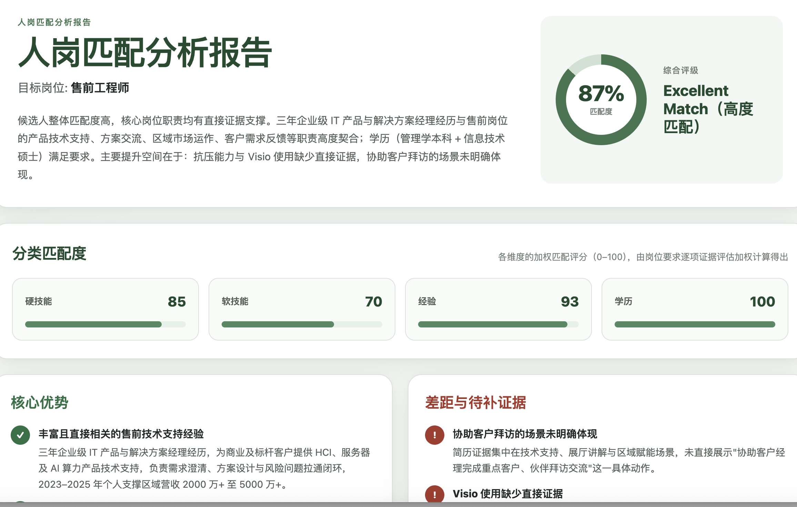
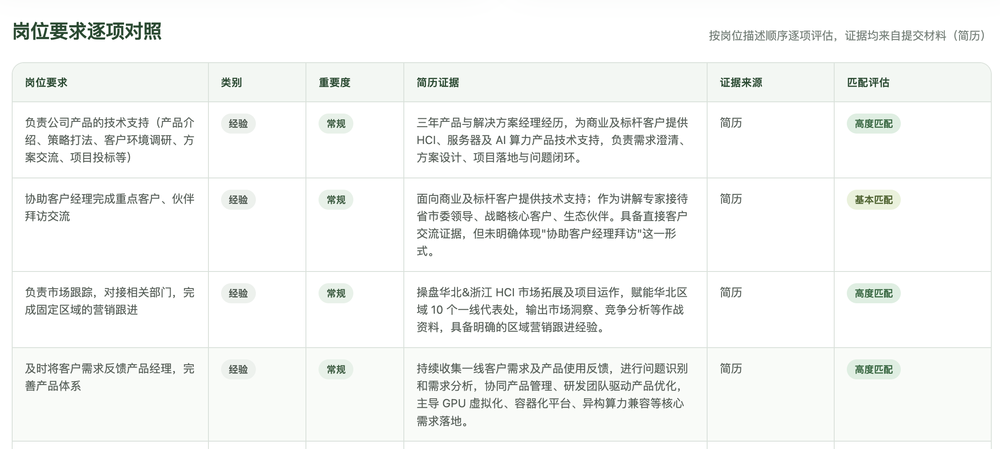
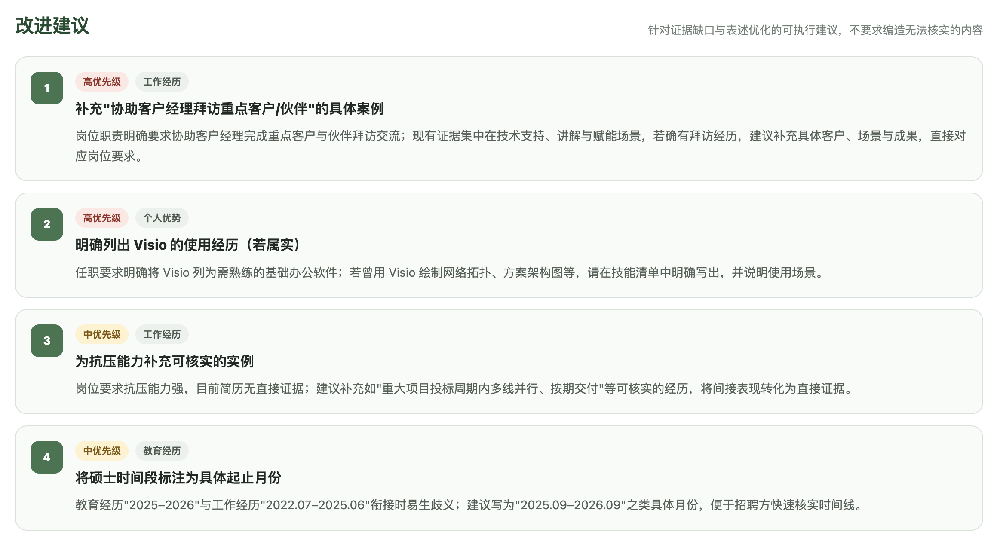

# CareerPilot CV Analyst

CareerPilot CV Analyst is a reusable skill that compares a candidate's CV with a target job description and generates a structured, evidence-based HTML report.

## Features

- Calculates an overall job-match score and category scores.
- Identifies relevant strengths, evidence gaps, and CV issues.
- Compares the CV with each substantive job requirement.
- Provides practical, job-targeted improvement suggestions.
- Produces a self-contained HTML report that works without external APIs or network resources.

## Example report

The following screenshots show an example report generated from anonymised sample data.

### Overall match and category scores



### Requirement-by-requirement comparison



### Prioritised improvement suggestions



## Required inputs

Provide both:

1. A CV as an attached file or pasted text.
2. A target job description as an attached file or pasted text.

Supplementary materials, a preferred report language, and a preferred output filename are optional.

## Installation

Copy this complete folder to:

```text
$HOME/.agents/skills/careerpilot-cv-analyst
```

Codex normally detects newly installed skills automatically. Restart Codex if the skill does not appear.

## Usage

In Codex, mention the skill with `$careerpilot-cv-analyst`. In the ChatGPT desktop app, select the skill with `@`.

Example request:

```text
$careerpilot-cv-analyst Analyse my attached CV against the attached job description and generate the report in English.
```

If either required input is missing, the skill asks for it before starting the analysis.

## Output

The primary output is a self-contained file named:

```text
careerpilot-cv-analysis.html
```

The report includes the overall match, category scores, strengths, gaps, requirement-level evidence, must-fix issues, and prioritised suggestions.

## Privacy and limitations

- The skill uses the model available in the current environment and does not require a separate API key.
- It does not upload documents to an external service unless the user explicitly requests and authorises it.
- Results are based only on the materials provided by the user.
- The report is advisory and does not represent a hiring decision or guarantee an employment outcome.

## Project structure

```text
careerpilot-cv-analyst/
├── SKILL.md
├── README.md
├── assets/
│   └── report-template.html
├── docs/
│   └── images/
│       ├── improvement-suggestions.png
│       ├── report-overview.png
│       └── requirement-comparison.png
└── references/
    ├── analysis-rubric.md
    └── result-schema.md
```
